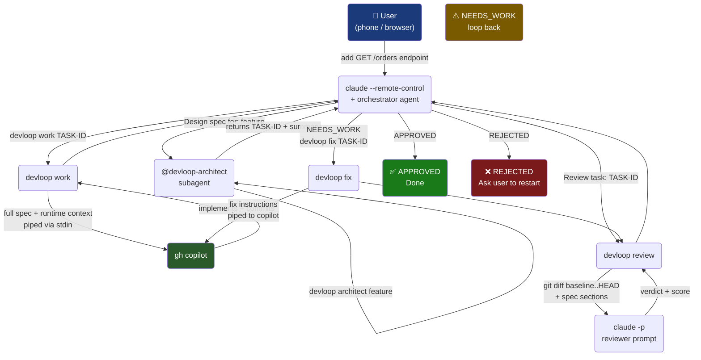
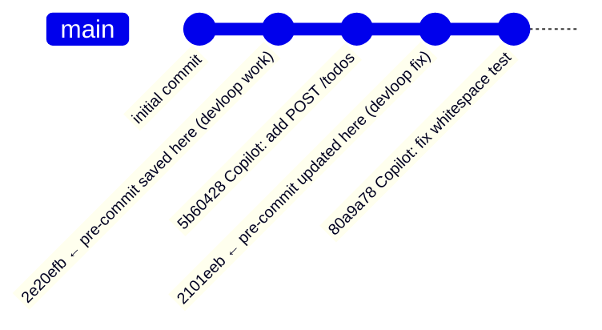
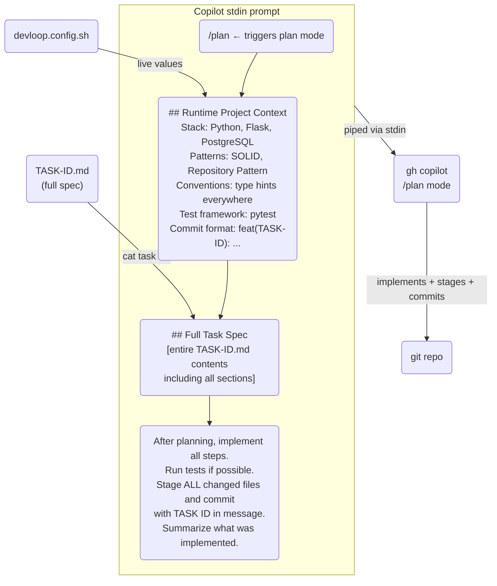
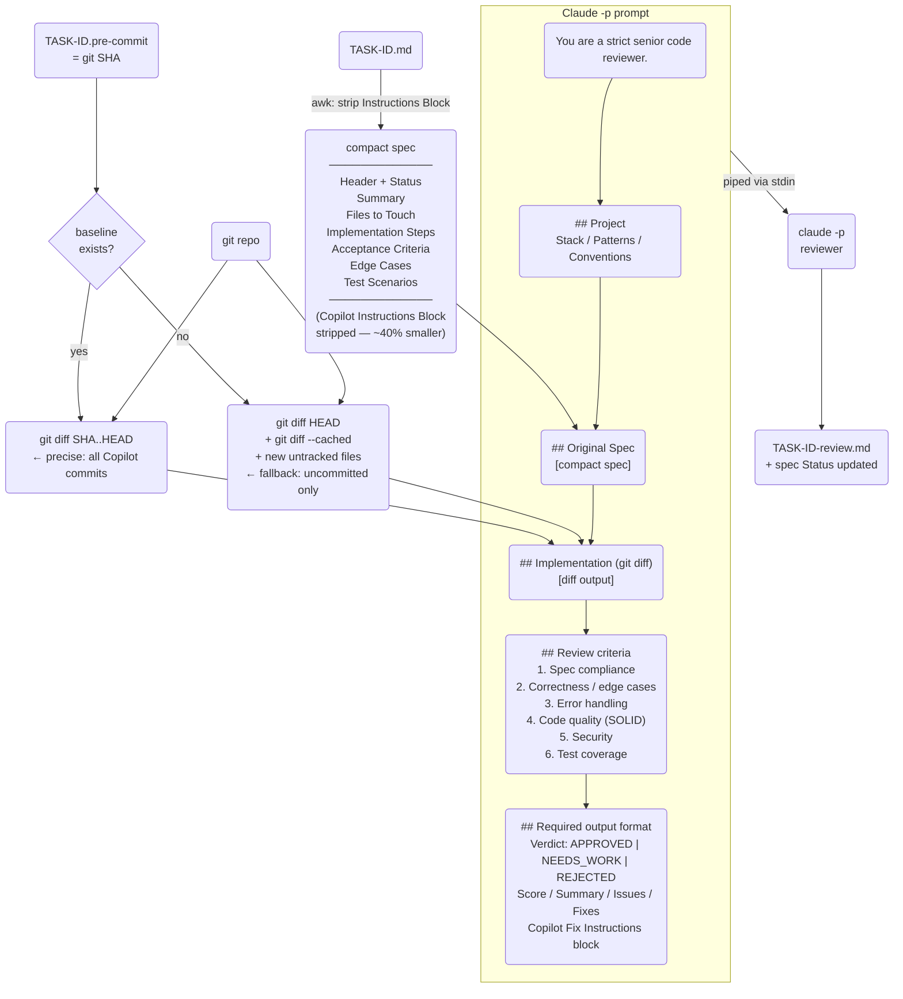
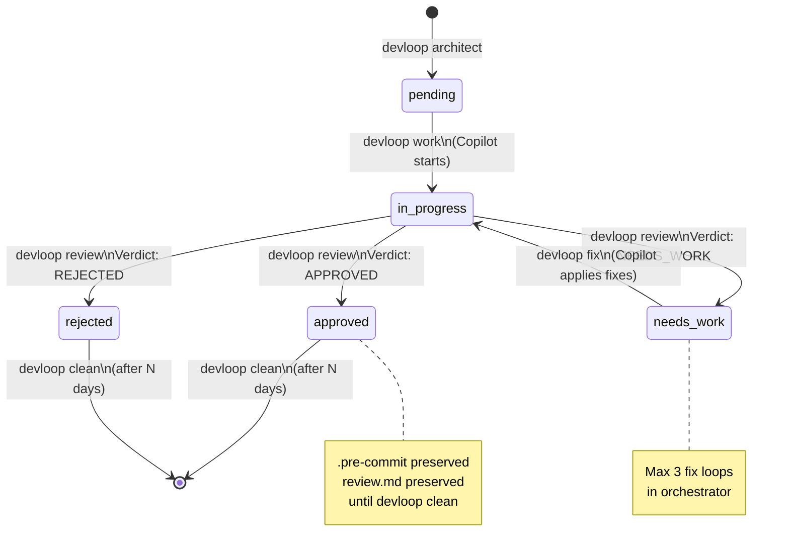
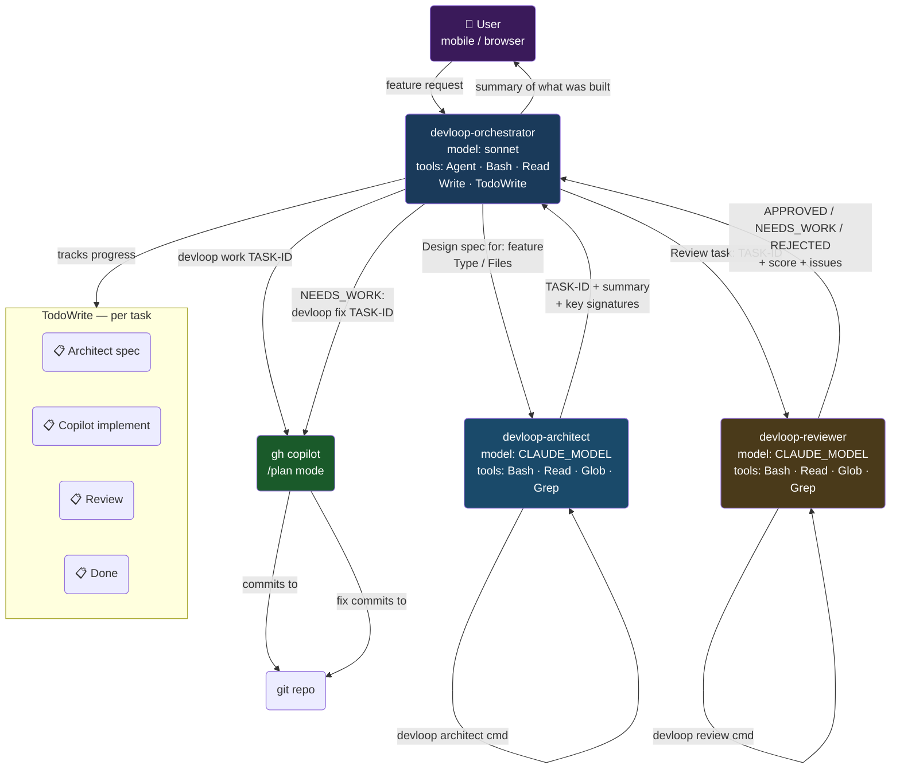
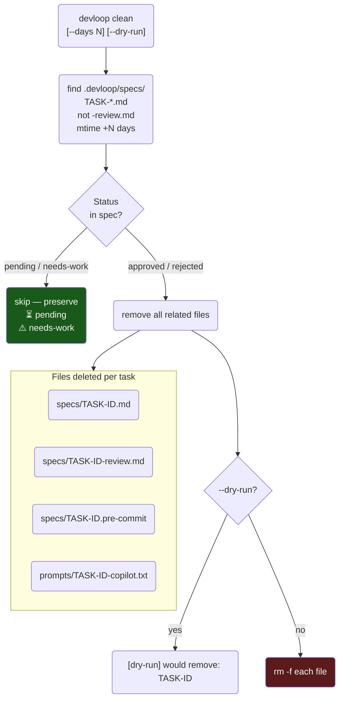

```mermaid
flowchart TD
    A_CMD("devloop architect\n\"add feature\"")
    W_CMD("devloop work\nTASK-ID")
    R_CMD("devloop review\nTASK-ID")
    F_CMD("devloop fix\nTASK-ID")
    R2_CMD("devloop review\nTASK-ID  ← again")
    C_CMD("devloop clean")

    subgraph SPEC_FILES[".devloop/specs/"]
        SPEC("TASK-20260507-135420.md\n─────────────────\nFeature / Type\nStatus: pending ← mutated\nSummary\nFiles to Touch\nImplementation Steps\nAcceptance Criteria\nEdge Cases\nTest Scenarios\n## Copilot Instructions Block")
        PRECOMMIT("TASK-20260507-135420.pre-commit\n─────────────────\n2e20efb...  ← git SHA\n(HEAD before Copilot ran)")
        PRECOMMIT2("TASK-20260507-135420.pre-commit\n─────────────────\n2101eeb...  ← updated SHA\n(HEAD before fix ran)")
        REVIEW_FILE("TASK-20260507-135420-review.md\n─────────────────\nVerdict: NEEDS_WORK\nScore / Summary\nWhat's Good\nIssues Found\nRequired Fixes\n### Copilot Fix Instructions\n```\nFIX #1: ...\n```")
        REVIEW2_FILE("TASK-20260507-135420-review.md\n─────────────────\nVerdict: APPROVED ✅\nScore: 9/10\nNo fixes required")
    end

    subgraph PROMPT_FILES[".devloop/prompts/"]
        PROMPT("TASK-20260507-135420-copilot.txt\n─────────────────\nDEVLOOP TASK: TASK-...\nFEATURE: ...\nIMPLEMENT: ...\nRULES: ...\nEDGE CASES: ...\nTESTS REQUIRED: yes")
    end

    A_CMD -->|"writes"| SPEC
    A_CMD -->|"writes"| PROMPT
    W_CMD -->|"reads + validates"| SPEC
    W_CMD -->|"writes HEAD SHA"| PRECOMMIT
    R_CMD -->|"reads"| SPEC
    R_CMD -->|"reads SHA → git diff SHA..HEAD"| PRECOMMIT
    R_CMD -->|"writes"| REVIEW_FILE
    R_CMD -->|"updates Status → needs-work"| SPEC
    F_CMD -->|"reads fix block"| REVIEW_FILE
    F_CMD -->|"overwrites with new HEAD"| PRECOMMIT2
    R2_CMD -->|"reads"| SPEC
    R2_CMD -->|"reads new SHA → git diff"| PRECOMMIT2
    R2_CMD -->|"overwrites"| REVIEW2_FILE
    R2_CMD -->|"updates Status → approved"| SPEC
    C_CMD -->|"deletes all 4 files\nwhen approved + old enough"| SPEC
    C_CMD -->|"deletes"| PRECOMMIT2
    C_CMD -->|"deletes"| REVIEW2_FILE
    C_CMD -->|"deletes"| PROMPT

    style SPEC fill:#1a3a5a,color:#fff
    style PRECOMMIT fill:#3a1a5a,color:#fff
    style PRECOMMIT2 fill:#3a1a5a,color:#fff
    style REVIEW_FILE fill:#5a3a1a,color:#fff
    style REVIEW2_FILE fill:#1a5a1a,color:#fff
    style PROMPT fill:#1a4a4a,color:#fff
```

```mermaid
flowchart LR
    subgraph WORK_PHASE["devloop work"]
        W1("record HEAD\n→ 2e20efb\nwrite .pre-commit")
        W2("pipe full spec\n+ runtime context\nto copilot")
        W3("Copilot commits\n5b60428")
    end

    subgraph REVIEW_PHASE["devloop review"]
        R1("read .pre-commit\n= 2e20efb")
        R2("git diff 2e20efb..HEAD\n= everything Copilot added")
        R3("Claude reviews diff\nvs spec sections")
        R4("writes review.md\nVerdict: NEEDS_WORK")
    end

    subgraph FIX_PHASE["devloop fix"]
        F1("read review.md\nextract fix block")
        F2("pipe fix instructions\nto copilot")
        F3("Copilot commits\n2101eeb")
        F4("overwrite .pre-commit\n= 2101eeb")
    end

    subgraph REVIEW2_PHASE["devloop review (2nd)"]
        R5("read .pre-commit\n= 2101eeb")
        R6("git diff 2101eeb..HEAD\n= only the fix changes")
        R7("Claude reviews\nnew diff only")
        R8("Verdict: APPROVED ✅")
    end

    W1 --> W2 --> W3 --> R1
    R1 --> R2 --> R3 --> R4 --> F1
    F1 --> F2 --> F3 --> F4 --> R5
    R5 --> R6 --> R7 --> R8

    style R8 fill:#1a7a1a,color:#fff
    style R4 fill:#7a5a00,color:#fff
```

# DevLoop — Usage & Data Flow Graphs

---

## 1. Full Pipeline — End to End



---

## 2. Command Reference — All Commands & Aliases

```mermaid
flowchart LR
    subgraph SETUP["⚙️  Setup"]
        INSTALL("devloop install\n[path]")
        INIT("devloop init")
        UPDATE("devloop update")
    end

    subgraph SESSION["🖥️  Session"]
        START("devloop start  · s\n[project-name]")
        DAEMON("devloop daemon  · d\n[project-name]")
        D_STOP("devloop daemon stop")
        D_STATUS("devloop daemon status")
        D_LOG("devloop daemon log")
        D_UNINSTALL("devloop daemon uninstall")
    end

    subgraph PIPELINE["🔁  Pipeline"]
        ARCH("devloop architect  · a\n\"feature\" [type] [files]")
        WORK("devloop work  · w\n[TASK-ID]")
        REVIEW("devloop review  · r\n[TASK-ID]")
        FIX("devloop fix  · f\n[TASK-ID]")
    end

    subgraph INSPECT["🔎  Inspect"]
        TASKS("devloop tasks  · t")
        STATUS("devloop status\n[TASK-ID]")
        OPEN("devloop open  · o\n[TASK-ID]")
        BLOCK("devloop block  · b\n[TASK-ID]")
    end

    subgraph MAINT["🧹  Maintenance"]
        CLEAN("devloop clean\n[--days N] [--dry-run]")
    end

    ARCH --> WORK --> REVIEW --> FIX --> REVIEW
    DAEMON --> D_STOP & D_STATUS & D_LOG & D_UNINSTALL
```

---

## 3. `devloop init` — What Gets Created

```mermaid
flowchart TD
    INIT("devloop init")

    subgraph CONFIG["📄 Config"]
        C1("devloop.config.sh\nPROJECT_NAME, STACK,\nPATTERNS, TEST_FRAMEWORK\nCLAUDE_MODEL")
    end

    subgraph CLAUDE_FILES["🤖 Claude Context"]
        C2("CLAUDE.md\nProject-wide persistent\ninstructions for Claude Code")
    end

    subgraph AGENTS["🧠 Agent Definitions (.claude/agents/)"]
        A1("devloop-orchestrator.md\nmodel: sonnet\ntools: Agent, Bash, Read,\nWrite, TodoWrite")
        A2("devloop-architect.md\nmodel: ← CLAUDE_MODEL\ntools: Bash, Read, Glob, Grep")
        A3("devloop-reviewer.md\nmodel: ← CLAUDE_MODEL\ntools: Bash, Read, Glob, Grep")
    end

    subgraph COPILOT_FILES["🐙 Copilot Context"]
        CP("`.github/copilot-instructions.md`\nStack, patterns, conventions,\ntest framework, commit format,\nimplementation checklist")
    end

    subgraph DIRS["📁 Directories"]
        D1(".devloop/specs/\nTask specs + reviews + baselines")
        D2(".devloop/prompts/\nExtracted Copilot blocks")
    end

    INIT --> CONFIG & CLAUDE_FILES & AGENTS & COPILOT_FILES & DIRS

    note1["⚠️ Existing files are skipped\n— safe to re-run"]
    note2["CLAUDE_MODEL value\nbaked into both agents"]
    CONFIG -.-> note2
    note2 -.-> AGENTS
```

---

## 4. File Lifecycle — Per Task



---

## 5. Git Baseline Mechanism





---

## 6. `devloop work` — What Gets Sent to Copilot



---

## 7. `devloop review` — What Gets Sent to Claude



---

## 8. `devloop daemon` — Background Session & Auto-Restart

```mermaid
flowchart TD
    DAEMON("devloop daemon\n[project-name]")

    subgraph BACKGROUND["Background process (subshell)"]
        LOOP{"restart\nloop"}
        CAFF("caffeinate -is &\nprevent Mac sleep")
        CLAUDE_PROC("claude --remote-control\n\"DevLoop: project\"\n--agent devloop-orchestrator\n--permission-mode acceptEdits")
        WAIT("wait for claude exit")
        BACKOFF("exponential backoff\n5s → 10s → ... → 60s max\n20 retries then stop")
        LOG("append to\n.devloop/daemon.log")
    end

    subgraph AUTOSTART["Auto-start registration"]
        LAUNCHD("macOS: launchd\n~/Library/LaunchAgents/\ncom.devloop.project.plist\nRunAtLoad + KeepAlive")
        SYSTEMD("Linux: systemd user\n~/.config/systemd/user/\ndevloop-project.service\nWantedBy=default.target\nRestart=on-failure")
    end

    subgraph MGMT["Management commands"]
        STATUS("daemon status\ncheck PID + last 10 log lines")
        LOGCMD("daemon log\ntail -f daemon.log")
        STOP("daemon stop\nkill PID")
        UNINSTALL("daemon uninstall\nremove launchd/systemd entry")
    end

    DAEMON -->|"fork to background"| LOOP
    DAEMON --> AUTOSTART
    LOOP --> CAFF
    CAFF --> CLAUDE_PROC
    CLAUDE_PROC --> WAIT
    WAIT -->|"crash / disconnect"| LOG
    LOG --> BACKOFF
    BACKOFF -->|"retry < 20"| LOOP
    BACKOFF -->|"retry = 20"| EXIT("daemon exits")

    DAEMON --> MGMT
    STATUS & LOGCMD & STOP & UNINSTALL -.->|"reads/writes\ndaemon.pid"| DAEMON

    style EXIT fill:#7a1a1a,color:#fff
    style LAUNCHD fill:#1a3a5a,color:#fff
    style SYSTEMD fill:#1a4a2a,color:#fff
```

---

## 9. Status State Machine



---

## 10. Agent Collaboration Map



---

## 11. `devloop clean` — What Gets Removed


