# DevLoop — Usage & Data Flow Graphs

> **Two-track project.** v5 is the battle-tested Bash script (`devloop.sh`).
> v6 is a standalone Go binary with a session pool, SQLite persistence, parallel dispatch, and 4 AI backends.
> Both ship from the same repo and co-exist on disk.

| | **v5 (devloop.sh)** | **v6 (Go binary)** |
|---|---|---|
| Entry point | `devloop.sh` / `devloop` symlink | `devloop` binary (GoReleaser) |
| Install | `devloop update` / `curl raw.githubusercontent.com/…/devloop.sh` | `curl … install.sh` / `go install github.com/shaifulshabuj/devloop/v6/cmd/devloop@latest` |
| AI backends | Claude + Copilot (configurable in `devloop.config.sh`) | claude · copilot · opencode · pi (all 4 auto-detected at startup) |
| Persistence | Files in `.devloop/specs/` | SQLite `~/.devloop/devloop.db` |
| Session reuse | Cold-start each run | Session pool — warm sessions reused across tasks |
| Config | `devloop.config.sh` | `~/.devloop/config.toml` + `.devloop/config.toml` |
| Orchestration | Shell script pipeline | Go: Plan → Router → Dispatcher / ParallelDispatcher / AutonomousRunner |
| Module path | — | `github.com/shaifulshabuj/devloop/v6` |
| SQLite driver | — | `modernc.org/sqlite` (pure Go, CGO_ENABLED=0) |

---

## 1. v6 Architecture Overview

```mermaid
flowchart TD
    USER("👤 User")
    CLI("devloop binary\nCobra CLI")
    ORCH("orchestrator.Orchestrator\nPlan() — heuristic step gen")
    ROUTER("orchestrator.Router\nClassify() → backend + model\ncode · review · test · doc · general")
    DISP("orchestrator.Dispatcher\nDispatch() — sequential")
    PARDISP("orchestrator.ParallelDispatcher\nDispatch() — up to 4 concurrent")
    AUTO("orchestrator.AutonomousRunner\nPlan → Dispatch → AutoCommit → Learn")
    POOL("agent.SessionPool\nidle/warm/archived/dead\nUUID v5 keyed by project+role")
    RUNNER("agent.Runner\nDetect() + Spawn()")
    STORE("storage.Store\nSQLite modernc.org/sqlite")
    SERVER("server.Server\nHTTP :7777\nGET /tasks · POST /tasks · GET /health")
    GIT("internal/git.Client\nAutoCommit")
    LEARN("agent.LearningLoop\n.devloop/lessons.md")

    BACKENDS("Backends:\nclaude --permission-mode acceptEdits\ncopilot\nopencode\npi")

    DB[("~/.devloop/devloop.db\ntasks · steps · context_entries\nsessions · copilot_history")]
    CONTEXT_STORE("storage.ContextStore\nbuffered writer\n.devloop/context/")]

    USER --> CLI
    CLI --> ORCH
    ORCH --> ROUTER
    ROUTER --> DISP & PARDISP
    DISP & PARDISP --> POOL
    POOL --> RUNNER
    RUNNER -->|"exec subprocess"| BACKENDS
    ORCH --> STORE
    POOL --> STORE
    AUTO --> ORCH & DISP & GIT & LEARN
    CLI --> SERVER
    SERVER --> STORE
    STORE --> DB
    STORE --> CONTEXT_STORE

    style DB fill:#1a3a5a,color:#fff
    style BACKENDS fill:#1a4a2a,color:#fff
    style AUTO fill:#3a1a5a,color:#fff
```

---

## 2. v6 Command Reference

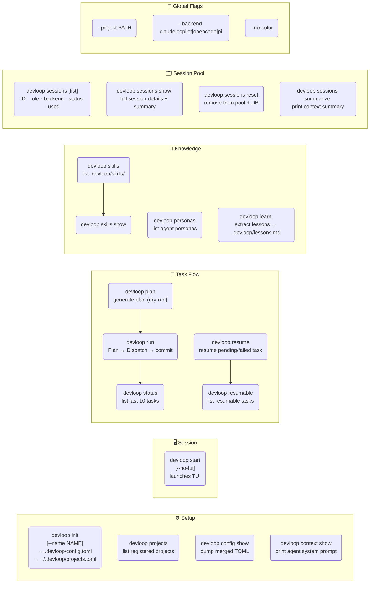
```mermaid
flowchart LR
    subgraph SETUP["⚙️  Setup"]
        INIT("devloop init\n[--name NAME]\n→ .devloop/config.toml\n→ ~/.devloop/projects.toml")
        PROJ("devloop projects\nlist registered projects")
        CFG("devloop config show\ndump merged TOML")
        CTX("devloop context show\nprint agent system prompt")
    end

    subgraph SESSION["🖥️  Session"]
        START("devloop start\n[--no-tui]\nlaunches TUI")
    end

    subgraph TASK_FLOW["🔁  Task Flow"]
        PLAN("devloop plan <task>\ngenerate plan (dry-run)")
        RUN("devloop run <task>\nPlan → Dispatch → commit")
        STATUS("devloop status\nlist last 10 tasks")
        RESUME("devloop resume <task-id>\nresume pending/failed task")
        RESUMABLE("devloop resumable\nlist resumable tasks")
    end

    subgraph KNOWLEDGE["🧠  Knowledge"]
        SKILLS("devloop skills\nlist .devloop/skills/")
        SKILLS_SHOW("devloop skills show <name>")
        PERSONAS("devloop personas\nlist agent personas")
        LEARN("devloop learn <task-id>\nextract lessons → .devloop/lessons.md")
    end

    subgraph SESSIONS_MGT["🗂️  Session Pool"]
        SESS_LIST("devloop sessions [list]\nID · role · backend · status · used")
        SESS_SHOW("devloop sessions show <id>\nfull session details + summary")
        SESS_RESET("devloop sessions reset <id>\nremove from pool + DB")
        SESS_SUM("devloop sessions summarize <id>\nprint context summary")
    end

    subgraph GLOBAL_FLAGS["🔧  Global Flags"]
        GF1("--project PATH")
        GF2("--backend claude|copilot|opencode|pi")
        GF3("--no-color")
    end

    PLAN --> RUN
    RUN --> STATUS
    RESUME --> RESUMABLE
    SKILLS --> SKILLS_SHOW
```

---

## 3. v6 Orchestration — Plan → Route → Dispatch

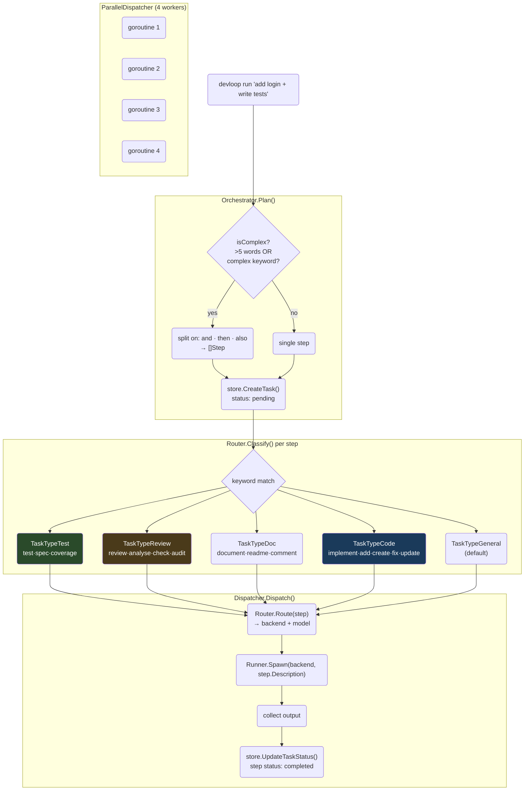
```mermaid
flowchart TD
    TASK("devloop run 'add login + write tests'")

    subgraph PLAN_PHASE["Orchestrator.Plan()"]
        CLASSIFY{"isComplex?\n>5 words OR\ncomplex keyword?"}
        SPLIT("split on: and · then · also\n→ []Step")
        SINGLE("single step")
        PERSIST("store.CreateTask()\nstatus: pending")
    end

    subgraph ROUTE_PHASE["Router.Classify() per step"]
        R1{"keyword match"}
        RT("TaskTypeTest\ntest·spec·coverage")
        RR("TaskTypeReview\nreview·analyse·check·audit")
        RD("TaskTypeDoc\ndocument·readme·comment")
        RC("TaskTypeCode\nimplement·add·create·fix·update")
        RG("TaskTypeGeneral\n(default)")
    end

    subgraph DISPATCH_PHASE["Dispatcher.Dispatch()"]
        PICK("Router.Route(step)\n→ backend + model")
        SPAWN("Runner.Spawn(backend, step.Description)")
        RESULT("collect output")
        UPDATE("store.UpdateTaskStatus()\nstep status: completed")
    end

    subgraph PARALLEL["ParallelDispatcher (4 workers)"]
        W1("goroutine 1")
        W2("goroutine 2")
        W3("goroutine 3")
        W4("goroutine 4")
    end

    TASK --> CLASSIFY
    CLASSIFY -->|"yes"| SPLIT
    CLASSIFY -->|"no"| SINGLE
    SPLIT & SINGLE --> PERSIST
    PERSIST --> R1
    R1 --> RT & RR & RD & RC & RG
    RT & RR & RD & RC & RG --> PICK
    PICK --> SPAWN
    SPAWN --> RESULT --> UPDATE

    style RT fill:#2a4a2a,color:#fff
    style RR fill:#4a3a1a,color:#fff
    style RC fill:#1a3a5a,color:#fff
```

---

## 4. v6 Session Pool Lifecycle

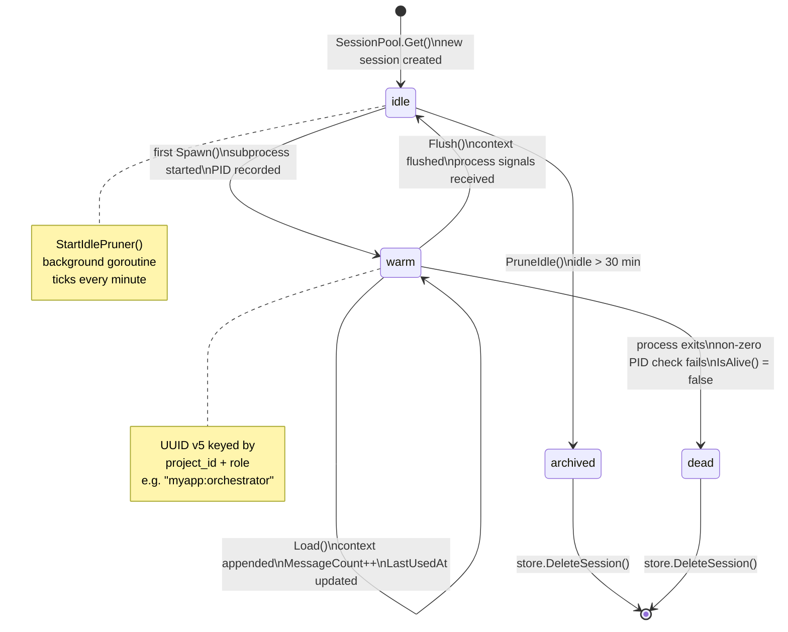
```mermaid
stateDiagram-v2
    [*] --> idle : SessionPool.Get()\nnew session created

    idle --> warm : first Spawn()\nsubprocess started\nPID recorded

    warm --> warm : Load()\ncontext appended\nMessageCount++\nLastUsedAt updated

    warm --> idle : Flush()\ncontext flushed\nprocess signals received

    idle --> archived : PruneIdle()\nidle > 30 min

    warm --> dead : process exits\nnon-zero PID check fails\nIsAlive() = false

    archived --> [*] : store.DeleteSession()

    dead --> [*] : store.DeleteSession()

    note right of warm
        UUID v5 keyed by
        project_id + role
        e.g. "myapp:orchestrator"
    end note

    note right of idle
        StartIdlePruner()
        background goroutine
        ticks every minute
    end note
```

---

## 5. v6 Backend Detection & Routing

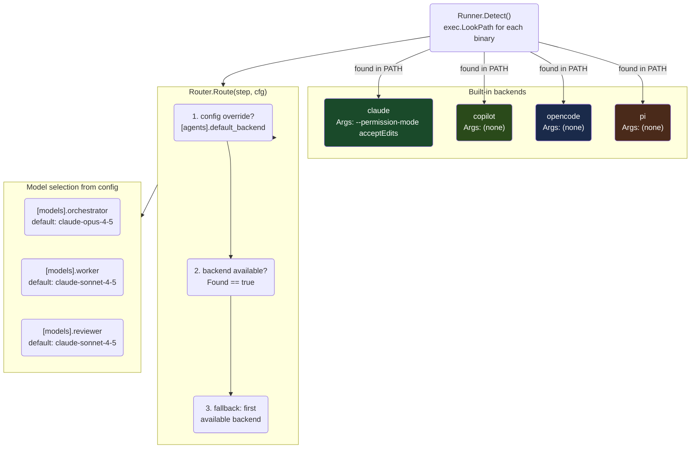
```mermaid
flowchart TD
    DETECT("Runner.Detect()\nexec.LookPath for each binary")

    subgraph BACKENDS["Built-in backends"]
        C("claude\nArgs: --permission-mode acceptEdits")
        CO("copilot\nArgs: (none)")
        OC("opencode\nArgs: (none)")
        PI("pi\nArgs: (none)")
    end

    DETECT -->|"found in PATH"| C & CO & OC & PI

    subgraph ROUTE["Router.Route(step, cfg)"]
        PREF("1. config override?\n[agents].default_backend")
        AVAIL("2. backend available?\nFound == true")
        FALLBACK("3. fallback: first\navailable backend")
    end

    subgraph MODELS["Model selection from config"]
        M1("[models].orchestrator\ndefault: claude-opus-4-5")
        M2("[models].worker\ndefault: claude-sonnet-4-5")
        M3("[models].reviewer\ndefault: claude-sonnet-4-5")
    end

    DETECT --> ROUTE
    ROUTE --> PREF --> AVAIL --> FALLBACK
    ROUTE --> MODELS

    style C fill:#1a4a2a,color:#fff
    style CO fill:#2a4a1a,color:#fff
    style OC fill:#1a2a4a,color:#fff
    style PI fill:#4a2a1a,color:#fff
```

---

## 6. v6 SQLite Storage Schema

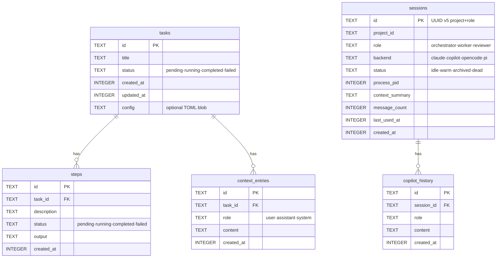
```mermaid
erDiagram
    tasks {
        TEXT id PK
        TEXT title
        TEXT status "pending·running·completed·failed"
        INTEGER created_at
        INTEGER updated_at
        TEXT config "optional TOML blob"
    }

    steps {
        TEXT id PK
        TEXT task_id FK
        TEXT description
        TEXT status "pending·running·completed·failed"
        TEXT output
        INTEGER created_at
    }

    context_entries {
        TEXT id PK
        TEXT task_id FK
        TEXT role "user·assistant·system"
        TEXT content
        INTEGER created_at
    }

    sessions {
        TEXT id PK "UUID v5 project+role"
        TEXT project_id
        TEXT role "orchestrator·worker·reviewer"
        TEXT backend "claude·copilot·opencode·pi"
        TEXT status "idle·warm·archived·dead"
        INTEGER process_pid
        TEXT context_summary
        INTEGER message_count
        INTEGER last_used_at
        INTEGER created_at
    }

    copilot_history {
        TEXT id PK
        TEXT session_id FK
        TEXT role
        TEXT content
        INTEGER created_at
    }

    tasks ||--o{ steps : "has"
    tasks ||--o{ context_entries : "has"
    sessions ||--o{ copilot_history : "has"
```

---

## 7. v6 AutonomousRunner — Full Pipeline

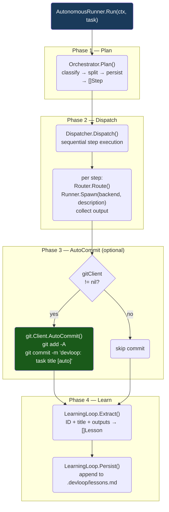
```mermaid
flowchart TD
    TRIGGER("AutonomousRunner.Run(ctx, task)")

    subgraph PHASE1["Phase 1 — Plan"]
        P("Orchestrator.Plan()\nclassify → split → persist\n→ []Step")
    end

    subgraph PHASE2["Phase 2 — Dispatch"]
        D("Dispatcher.Dispatch()\nsequential step execution")
        EACH("per step:\nRouter.Route()\nRunner.Spawn(backend, description)\ncollect output")
    end

    subgraph PHASE3["Phase 3 — AutoCommit (optional)"]
        GIT_CHECK{"gitClient\n!= nil?"}
        COMMIT("git.Client.AutoCommit()\ngit add -A\ngit commit -m 'devloop: task title [auto]'")
        SKIP("skip commit")
    end

    subgraph PHASE4["Phase 4 — Learn"]
        EXTRACT("LearningLoop.Extract()\nID + title + outputs → []Lesson")
        PERSIST("LearningLoop.Persist()\nappend to .devloop/lessons.md")
    end

    TRIGGER --> P --> D
    D --> EACH --> GIT_CHECK
    GIT_CHECK -->|"yes"| COMMIT
    GIT_CHECK -->|"no"| SKIP
    COMMIT & SKIP --> EXTRACT --> PERSIST

    style COMMIT fill:#1a5a1a,color:#fff
    style TRIGGER fill:#1a3a5a,color:#fff
```

---

## 8. v6 Install Methods

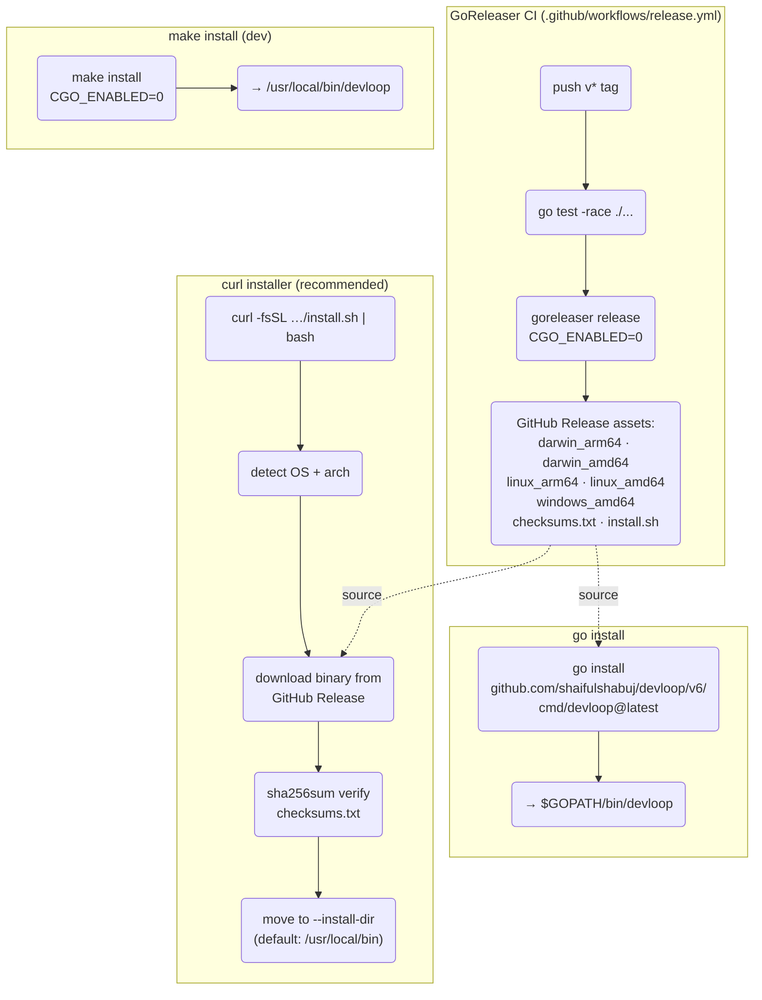
```mermaid
flowchart TD
    subgraph CI["GoReleaser CI (.github/workflows/release.yml)"]
        TAG("push v* tag")
        TESTS("go test -race ./...")
        BUILD("goreleaser release\nCGO_ENABLED=0")
        ASSETS("GitHub Release assets:\ndarwin_arm64 · darwin_amd64\nlinux_arm64 · linux_amd64\nwindows_amd64\nchecksums.txt · install.sh")
        TAG --> TESTS --> BUILD --> ASSETS
    end

    subgraph INSTALL1["curl installer (recommended)"]
        CURL("curl -fsSL …/install.sh | bash")
        DETECT_OS("detect OS + arch")
        DOWNLOAD("download binary from\nGitHub Release")
        VERIFY("sha256sum verify\nchecksums.txt")
        MOVE("move to --install-dir\n(default: /usr/local/bin)")
        CURL --> DETECT_OS --> DOWNLOAD --> VERIFY --> MOVE
    end

    subgraph INSTALL2["go install"]
        GOCMD("go install\ngithub.com/shaifulshabuj/devloop/v6/\ncmd/devloop@latest")
        GOBIN("→ $GOPATH/bin/devloop")
        GOCMD --> GOBIN
    end

    subgraph INSTALL3["make install (dev)"]
        MAKE("make install\nCGO_ENABLED=0")
        MAKEBIN("→ /usr/local/bin/devloop")
        MAKE --> MAKEBIN
    end

    ASSETS -.->|"source"| DOWNLOAD
    ASSETS -.->|"source"| GOCMD
```

---

## 9. v5 vs v6 — Dual Track Architecture

```mermaid
flowchart LR
    subgraph V5["v5 — devloop.sh (Bash)"]
        V5S("devloop.sh\n~380KB, 9700+ lines")
        V5C("devloop.config.sh\nPROJECT_NAME, STACK,\nPATTERNS, TEST_FRAMEWORK\nCLAUDE_MODEL, COPILOT_MODEL")
        V5A(".claude/agents/\norchestrator.md\narchitect.md\nreviewer.md")
        V5F(".devloop/specs/\nTASK-*.md\nTASK-*.pre-commit\nTASK-*-review.md")
        V5P(".devloop/prompts/\nTASK-*-copilot.txt")
        V5U("devloop update\n← downloads from\nraw.githubusercontent.com/main")
    end

    subgraph V6["v6 — Go binary"]
        V6B("devloop binary\nGo 1.26+, CGO_ENABLED=0\nmodule: .../devloop/v6")
        V6C(".devloop/config.toml\n~/.devloop/config.toml\n[project] [agents] [models] [storage]")
        V6DB("~/.devloop/devloop.db\nSQLite (modernc/sqlite)\ntasks·steps·sessions·context")
        V6POOL("agent.SessionPool\nidle/warm reuse\n30m idle timeout")
        V6U("go install @latest\ncurl install.sh\n← GoReleaser binary release")
    end

    V5 <-.->|"co-exist\nsame repo\ndifferent binaries"| V6

    style V5 fill:#1a3a5a,color:#fff
    style V6 fill:#1a4a1a,color:#fff
```

---

## 10. Full Pipeline — v5 End to End (Bash orchestration)

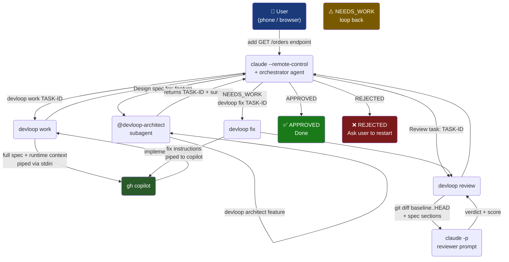
```mermaid
flowchart TD
    USER("👤 User\n(phone / browser)")
    CLAUDE_START("claude --remote-control\n+ orchestrator agent")
    ARCH("@devloop-architect\nsubagent")
    WORK("devloop work")
    COPILOT("gh copilot")
    REVIEW("devloop review")
    CLAUDE_REVIEW("claude -p\nreviewer prompt")
    FIX("devloop fix")

    APPROVED("✅ APPROVED\nDone")
    NEEDSWORK("⚠️ NEEDS_WORK\nloop back")
    REJECTED("❌ REJECTED\nAsk user to restart")

    USER -->|"add GET /orders endpoint"| CLAUDE_START
    CLAUDE_START -->|"Design spec for: feature"| ARCH
    ARCH -->|"devloop architect feature"| ARCH
    ARCH -->|"returns TASK-ID + summary"| CLAUDE_START
    CLAUDE_START -->|"devloop work TASK-ID"| WORK
    WORK -->|"full spec + runtime context\npiped via stdin"| COPILOT
    COPILOT -->|"implements + commits"| WORK
    WORK --> CLAUDE_START
    CLAUDE_START -->|"Review task: TASK-ID"| REVIEW
    REVIEW -->|"git diff baseline..HEAD\n+ spec sections"| CLAUDE_REVIEW
    CLAUDE_REVIEW -->|"verdict + score"| REVIEW
    REVIEW --> CLAUDE_START

    CLAUDE_START -->|"APPROVED"| APPROVED
    CLAUDE_START -->|"NEEDS_WORK\ndevloop fix TASK-ID"| FIX
    FIX -->|"fix instructions\npiped to copilot"| COPILOT
    FIX --> REVIEW
    CLAUDE_START -->|"REJECTED"| REJECTED

    style APPROVED fill:#1a7a1a,color:#fff
    style REJECTED fill:#7a1a1a,color:#fff
    style NEEDSWORK fill:#7a5a00,color:#fff
    style USER fill:#1a3a7a,color:#fff
    style COPILOT fill:#2a5a2a,color:#fff
```

---

## 11. v5 Command Reference

```mermaid
flowchart LR
    subgraph SETUP["⚙️  Setup"]
        INSTALL("devloop install\n[path]")
        INIT("devloop init")
        UPDATE("devloop update")
    end

    subgraph SESSION["🖥️  Session"]
        START("devloop start  · s\n[project-name]")
        DAEMON("devloop daemon  · d\n[project-name]")
        D_STOP("devloop daemon stop")
        D_STATUS("devloop daemon status")
        D_LOG("devloop daemon log")
        D_UNINSTALL("devloop daemon uninstall")
    end

    subgraph PIPELINE["🔁  Pipeline"]
        ARCH("devloop architect  · a\n\"feature\" [type] [files]")
        WORK("devloop work  · w\n[TASK-ID]")
        REVIEW("devloop review  · r\n[TASK-ID]")
        FIX("devloop fix  · f\n[TASK-ID]")
    end

    subgraph INSPECT["🔎  Inspect"]
        TASKS("devloop tasks  · t")
        STATUS("devloop status\n[TASK-ID]")
        OPEN("devloop open  · o\n[TASK-ID]")
        BLOCK("devloop block  · b\n[TASK-ID]")
    end

    subgraph MAINT["🧹  Maintenance"]
        CLEAN("devloop clean\n[--days N] [--dry-run]")
    end

    ARCH --> WORK --> REVIEW --> FIX --> REVIEW
    DAEMON --> D_STOP & D_STATUS & D_LOG & D_UNINSTALL
```

---

## 12. v5 `devloop init` — What Gets Created

```mermaid
flowchart TD
    INIT("devloop init")

    subgraph CONFIG["📄 Config"]
        C1("devloop.config.sh\nPROJECT_NAME, STACK,\nPATTERNS, TEST_FRAMEWORK\nCLAUDE_MODEL")
    end

    subgraph CLAUDE_FILES["🤖 Claude Context"]
        C2("CLAUDE.md\nProject-wide persistent\ninstructions for Claude Code")
    end

    subgraph AGENTS["🧠 Agent Definitions (.claude/agents/)"]
        A1("devloop-orchestrator.md\nmodel: sonnet\ntools: Agent, Bash, Read,\nWrite, TodoWrite")
        A2("devloop-architect.md\nmodel: ← CLAUDE_MODEL\ntools: Bash, Read, Glob, Grep")
        A3("devloop-reviewer.md\nmodel: ← CLAUDE_MODEL\ntools: Bash, Read, Glob, Grep")
    end

    subgraph COPILOT_FILES["🐙 Copilot Context"]
        CP("`.github/copilot-instructions.md`\nStack, patterns, conventions,\ntest framework, commit format,\nimplementation checklist")
    end

    subgraph DIRS["📁 Directories"]
        D1(".devloop/specs/\nTask specs + reviews + baselines")
        D2(".devloop/prompts/\nExtracted Copilot blocks")
    end

    INIT --> CONFIG & CLAUDE_FILES & AGENTS & COPILOT_FILES & DIRS

    note1["⚠️ Existing files are skipped\n— safe to re-run"]
    note2["CLAUDE_MODEL value\nbaked into both agents"]
    CONFIG -.-> note2
    note2 -.-> AGENTS
```

---

## 13. v5 File Lifecycle — Per Task

```mermaid
flowchart TD
    A_CMD("devloop architect\n\"add feature\"")
    W_CMD("devloop work\nTASK-ID")
    R_CMD("devloop review\nTASK-ID")
    F_CMD("devloop fix\nTASK-ID")
    R2_CMD("devloop review\nTASK-ID  ← again")
    C_CMD("devloop clean")

    subgraph SPEC_FILES[".devloop/specs/"]
        SPEC("TASK-20260507-135420.md\n─────────────────\nFeature / Type\nStatus: pending ← mutated\nSummary\nFiles to Touch\nImplementation Steps\nAcceptance Criteria\nEdge Cases\nTest Scenarios\n## Copilot Instructions Block")
        PRECOMMIT("TASK-20260507-135420.pre-commit\n─────────────────\n2e20efb...  ← git SHA\n(HEAD before Copilot ran)")
        PRECOMMIT2("TASK-20260507-135420.pre-commit\n─────────────────\n2101eeb...  ← updated SHA\n(HEAD before fix ran)")
        REVIEW_FILE("TASK-20260507-135420-review.md\n─────────────────\nVerdict: NEEDS_WORK\nScore / Summary\nWhat's Good\nIssues Found\nRequired Fixes\n### Copilot Fix Instructions\n```\nFIX #1: ...\n```")
        REVIEW2_FILE("TASK-20260507-135420-review.md\n─────────────────\nVerdict: APPROVED ✅\nScore: 9/10\nNo fixes required")
    end

    subgraph PROMPT_FILES[".devloop/prompts/"]
        PROMPT("TASK-20260507-135420-copilot.txt\n─────────────────\nDEVLOOP TASK: TASK-...\nFEATURE: ...\nIMPLEMENT: ...\nRULES: ...\nEDGE CASES: ...\nTESTS REQUIRED: yes")
    end

    A_CMD -->|"writes"| SPEC
    A_CMD -->|"writes"| PROMPT
    W_CMD -->|"reads + validates"| SPEC
    W_CMD -->|"writes HEAD SHA"| PRECOMMIT
    R_CMD -->|"reads"| SPEC
    R_CMD -->|"reads SHA → git diff SHA..HEAD"| PRECOMMIT
    R_CMD -->|"writes"| REVIEW_FILE
    R_CMD -->|"updates Status → needs-work"| SPEC
    F_CMD -->|"reads fix block"| REVIEW_FILE
    F_CMD -->|"overwrites with new HEAD"| PRECOMMIT2
    R2_CMD -->|"reads"| SPEC
    R2_CMD -->|"reads new SHA → git diff"| PRECOMMIT2
    R2_CMD -->|"overwrites"| REVIEW2_FILE
    R2_CMD -->|"updates Status → approved"| SPEC
    C_CMD -->|"deletes all 4 files\nwhen approved + old enough"| SPEC
    C_CMD -->|"deletes"| PRECOMMIT2
    C_CMD -->|"deletes"| REVIEW2_FILE
    C_CMD -->|"deletes"| PROMPT

    style SPEC fill:#1a3a5a,color:#fff
    style PRECOMMIT fill:#3a1a5a,color:#fff
    style PRECOMMIT2 fill:#3a1a5a,color:#fff
    style REVIEW_FILE fill:#5a3a1a,color:#fff
    style REVIEW2_FILE fill:#1a5a1a,color:#fff
    style PROMPT fill:#1a4a4a,color:#fff
```

---

## 14. v5 Git Baseline Mechanism

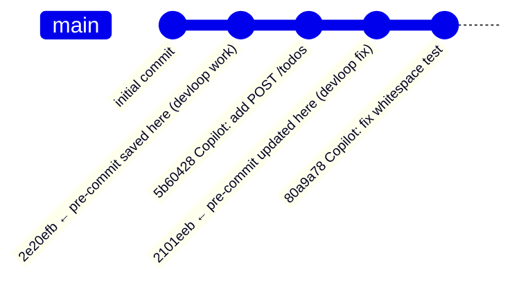
```mermaid
gitGraph
   commit id: "initial commit"
   commit id: "2e20efb ← pre-commit saved here (devloop work)"
   commit id: "5b60428 Copilot: add POST /todos"
   commit id: "2101eeb ← pre-commit updated here (devloop fix)"
   commit id: "80a9a78 Copilot: fix whitespace test"
```

```mermaid
flowchart LR
    subgraph WORK_PHASE["devloop work"]
        W1("record HEAD\n→ 2e20efb\nwrite .pre-commit")
        W2("pipe full spec\n+ runtime context\nto copilot")
        W3("Copilot commits\n5b60428")
    end

    subgraph REVIEW_PHASE["devloop review"]
        R1("read .pre-commit\n= 2e20efb")
        R2("git diff 2e20efb..HEAD\n= everything Copilot added")
        R3("Claude reviews diff\nvs spec sections")
        R4("writes review.md\nVerdict: NEEDS_WORK")
    end

    subgraph FIX_PHASE["devloop fix"]
        F1("read review.md\nextract fix block")
        F2("pipe fix instructions\nto copilot")
        F3("Copilot commits\n2101eeb")
        F4("overwrite .pre-commit\n= 2101eeb")
    end

    subgraph REVIEW2_PHASE["devloop review (2nd)"]
        R5("read .pre-commit\n= 2101eeb")
        R6("git diff 2101eeb..HEAD\n= only the fix changes")
        R7("Claude reviews\nnew diff only")
        R8("Verdict: APPROVED ✅")
    end

    W1 --> W2 --> W3 --> R1
    R1 --> R2 --> R3 --> R4 --> F1
    F1 --> F2 --> F3 --> F4 --> R5
    R5 --> R6 --> R7 --> R8

    style R8 fill:#1a7a1a,color:#fff
    style R4 fill:#7a5a00,color:#fff
```

---

## 15. v5 `devloop work` — What Gets Sent to Copilot

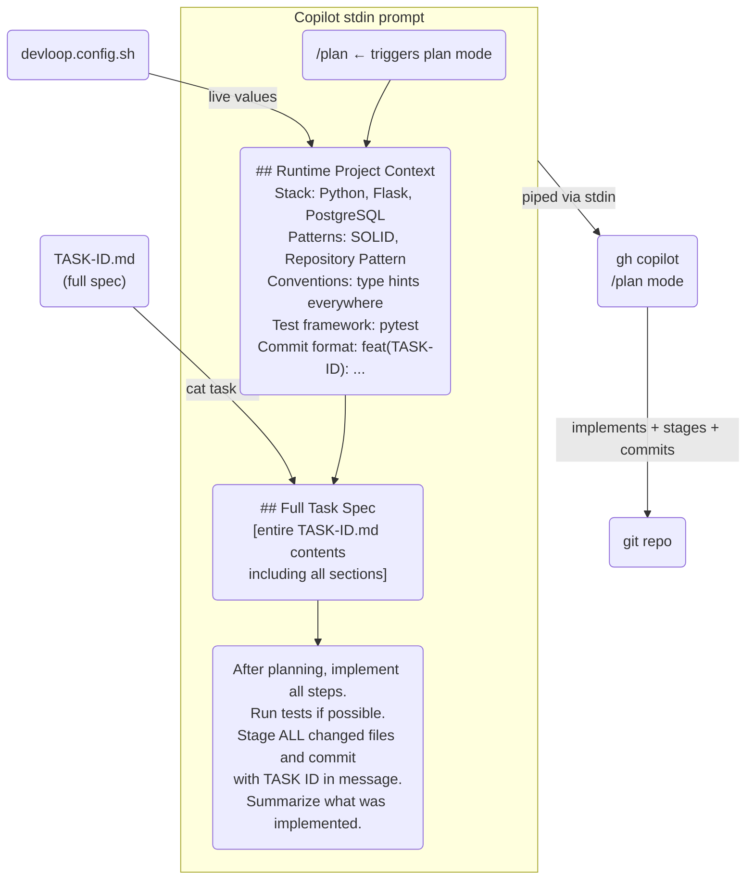
```mermaid
flowchart TD
    SPEC_FILE("TASK-ID.md\n(full spec)")
    CONFIG("devloop.config.sh")

    subgraph PROMPT["Copilot stdin prompt"]
        P1("/plan  ← triggers plan mode")
        P2("## Runtime Project Context\nStack: Python, Flask, PostgreSQL\nPatterns: SOLID, Repository Pattern\nConventions: type hints everywhere\nTest framework: pytest\nCommit format: feat(TASK-ID): ...")
        P3("## Full Task Spec\n[entire TASK-ID.md contents\nincluding all sections]")
        P4("After planning, implement all steps.\nRun tests if possible.\nStage ALL changed files and commit\nwith TASK ID in message.\nSummarize what was implemented.")
        P1 --> P2 --> P3 --> P4
    end

    SPEC_FILE -->|"cat task file"| P3
    CONFIG -->|"live values"| P2

    COPILOT("gh copilot\n/plan mode")
    PROMPT -->|"piped via stdin"| COPILOT
    COPILOT -->|"implements + stages + commits"| GIT("git repo")
```

---

## 16. v5 `devloop review` — What Gets Sent to Claude

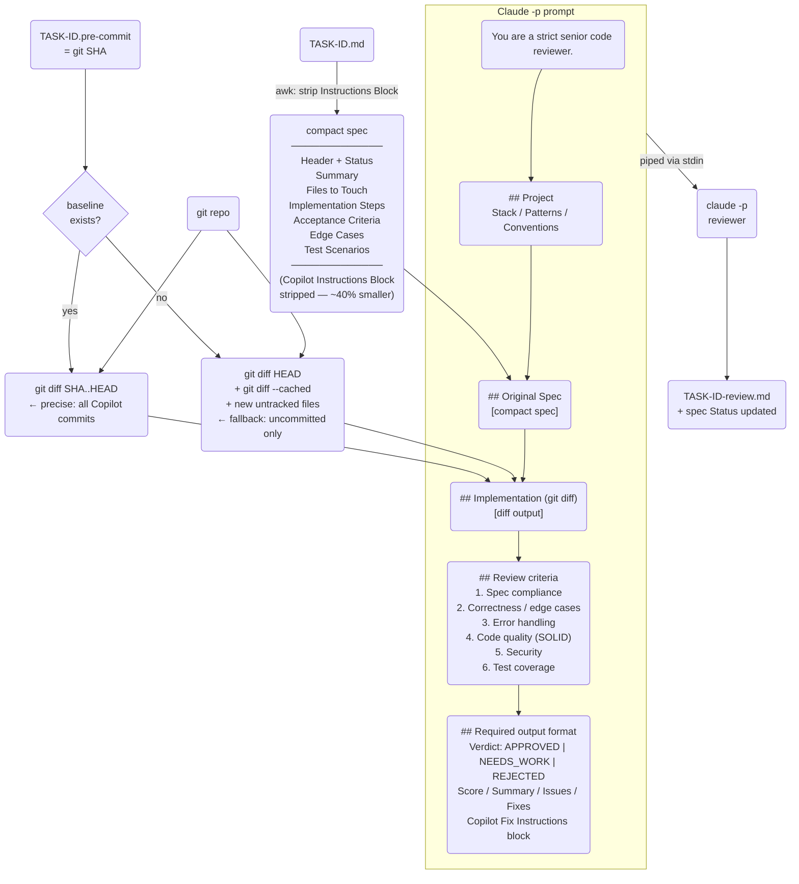
```mermaid
flowchart TD
    PRE("TASK-ID.pre-commit\n= git SHA")
    SPEC("TASK-ID.md")
    GIT("git repo")

    DIFF_CALC{"baseline\nexists?"}
    DIFF_A("git diff SHA..HEAD\n← precise: all Copilot commits")
    DIFF_B("git diff HEAD\n+ git diff --cached\n+ new untracked files\n← fallback: uncommitted only")

    COMPACT_SPEC("compact spec\n─────────────\nHeader + Status\nSummary\nFiles to Touch\nImplementation Steps\nAcceptance Criteria\nEdge Cases\nTest Scenarios\n─────────────\n(Copilot Instructions Block\nstripped — ~40% smaller)")

    subgraph REVIEW_PROMPT["Claude -p prompt"]
        RP1("You are a strict senior code reviewer.")
        RP2("## Project\nStack / Patterns / Conventions")
        RP3("## Original Spec\n[compact spec]")
        RP4("## Implementation (git diff)\n[diff output]")
        RP5("## Review criteria\n1. Spec compliance\n2. Correctness / edge cases\n3. Error handling\n4. Code quality (SOLID)\n5. Security\n6. Test coverage")
        RP6("## Required output format\nVerdict: APPROVED | NEEDS_WORK | REJECTED\nScore / Summary / Issues / Fixes\nCopilot Fix Instructions block")
    end

    CLAUDE("claude -p\nreviewer")
    REVIEW_OUT("TASK-ID-review.md\n+ spec Status updated")

    PRE --> DIFF_CALC
    DIFF_CALC -->|"yes"| DIFF_A
    DIFF_CALC -->|"no"| DIFF_B
    GIT --> DIFF_A & DIFF_B
    SPEC -->|"awk: strip Instructions Block"| COMPACT_SPEC
    COMPACT_SPEC --> RP3
    DIFF_A & DIFF_B --> RP4
    RP1 --> RP2 --> RP3 --> RP4 --> RP5 --> RP6
    REVIEW_PROMPT -->|"piped via stdin"| CLAUDE
    CLAUDE --> REVIEW_OUT
```

---

## 17. v5 `devloop daemon` — Background Session & Auto-Restart

```mermaid
flowchart TD
    DAEMON("devloop daemon\n[project-name]")

    subgraph BACKGROUND["Background process (subshell)"]
        LOOP{"restart\nloop"}
        CAFF("caffeinate -is &\nprevent Mac sleep")
        CLAUDE_PROC("claude --remote-control\n\"DevLoop: project\"\n--agent devloop-orchestrator\n--permission-mode acceptEdits")
        WAIT("wait for claude exit")
        BACKOFF("exponential backoff\n5s → 10s → ... → 60s max\n20 retries then stop")
        LOG("append to\n.devloop/daemon.log")
    end

    subgraph AUTOSTART["Auto-start registration"]
        LAUNCHD("macOS: launchd\n~/Library/LaunchAgents/\ncom.devloop.project.plist\nRunAtLoad + KeepAlive")
        SYSTEMD("Linux: systemd user\n~/.config/systemd/user/\ndevloop-project.service\nWantedBy=default.target\nRestart=on-failure")
    end

    subgraph MGMT["Management commands"]
        STATUS("daemon status\ncheck PID + last 10 log lines")
        LOGCMD("daemon log\ntail -f daemon.log")
        STOP("daemon stop\nkill PID")
        UNINSTALL("daemon uninstall\nremove launchd/systemd entry")
    end

    DAEMON -->|"fork to background"| LOOP
    DAEMON --> AUTOSTART
    LOOP --> CAFF
    CAFF --> CLAUDE_PROC
    CLAUDE_PROC --> WAIT
    WAIT -->|"crash / disconnect"| LOG
    LOG --> BACKOFF
    BACKOFF -->|"retry < 20"| LOOP
    BACKOFF -->|"retry = 20"| EXIT("daemon exits")

    DAEMON --> MGMT
    STATUS & LOGCMD & STOP & UNINSTALL -.->|"reads/writes\ndaemon.pid"| DAEMON

    style EXIT fill:#7a1a1a,color:#fff
    style LAUNCHD fill:#1a3a5a,color:#fff
    style SYSTEMD fill:#1a4a2a,color:#fff
```

---

## 18. v5 Status State Machine

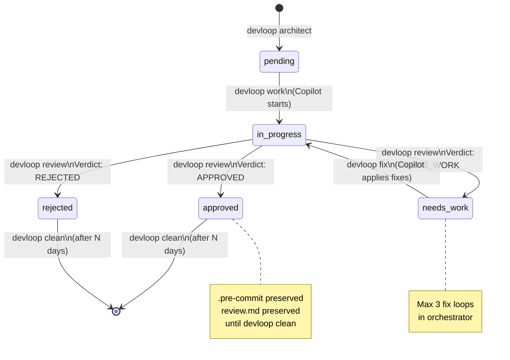
```mermaid
stateDiagram-v2
    [*] --> pending : devloop architect

    pending --> in_progress : devloop work\n(Copilot starts)

    in_progress --> needs_work : devloop review\nVerdict: NEEDS_WORK

    in_progress --> approved : devloop review\nVerdict: APPROVED

    in_progress --> rejected : devloop review\nVerdict: REJECTED

    needs_work --> in_progress : devloop fix\n(Copilot applies fixes)

    approved --> [*] : devloop clean\n(after N days)
    rejected --> [*] : devloop clean\n(after N days)

    note right of needs_work
        Max 3 fix loops
        in orchestrator
    end note

    note right of approved
        .pre-commit preserved
        review.md preserved
        until devloop clean
    end note
```

---

## 19. v5 Agent Collaboration Map

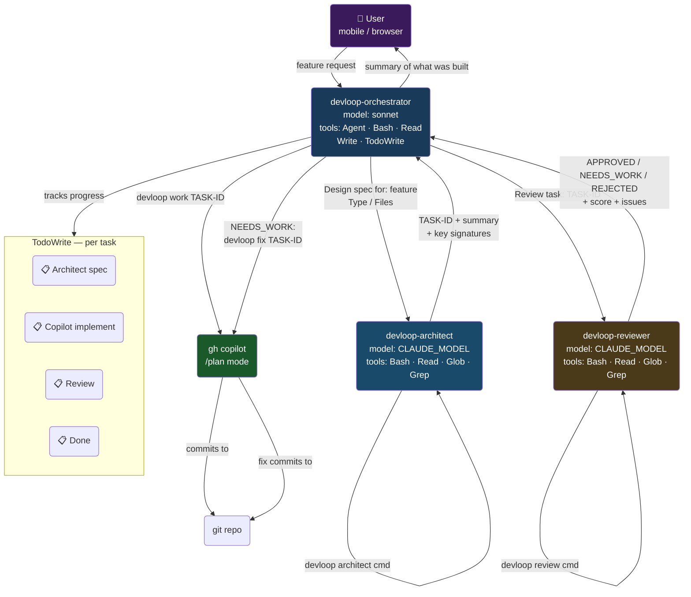
```mermaid
flowchart TD
    USER("👤 User\nmobile / browser")
    ORCH("devloop-orchestrator\nmodel: sonnet\ntools: Agent · Bash · Read\nWrite · TodoWrite")
    ARCH("devloop-architect\nmodel: CLAUDE_MODEL\ntools: Bash · Read · Glob · Grep")
    REVI("devloop-reviewer\nmodel: CLAUDE_MODEL\ntools: Bash · Read · Glob · Grep")
    COPILOT("gh copilot\n/plan mode")
    GIT("git repo")

    subgraph TODO["TodoWrite — per task"]
        T1("📋 Architect spec")
        T2("📋 Copilot implement")
        T3("📋 Review")
        T4("📋 Done")
    end

    USER -->|"feature request"| ORCH
    ORCH -->|"tracks progress"| TODO
    ORCH -->|"Design spec for: feature\nType / Files"| ARCH
    ARCH -->|"devloop architect cmd"| ARCH
    ARCH -->|"TASK-ID + summary\n+ key signatures"| ORCH
    ORCH -->|"devloop work TASK-ID"| COPILOT
    COPILOT -->|"commits to"| GIT
    ORCH -->|"Review task: TASK-ID"| REVI
    REVI -->|"devloop review cmd"| REVI
    REVI -->|"APPROVED / NEEDS_WORK / REJECTED\n+ score + issues"| ORCH
    ORCH -->|"NEEDS_WORK:\ndevloop fix TASK-ID"| COPILOT
    COPILOT -->|"fix commits to"| GIT
    ORCH -->|"summary of what was built"| USER

    style ORCH fill:#1a3a5a,color:#fff
    style ARCH fill:#1a4a6a,color:#fff
    style REVI fill:#4a3a1a,color:#fff
    style COPILOT fill:#1a5a2a,color:#fff
    style USER fill:#3a1a5a,color:#fff
```

---

## 20. v5 `devloop clean` — What Gets Removed

```mermaid
flowchart TD
    CLEAN("devloop clean\n[--days N] [--dry-run]")
    FIND("find .devloop/specs/\nTASK-*.md\nnot -review.md\nmtime +N days")

    CLEAN --> FIND

    CHECK{"Status\nin spec?"}
    FIND --> CHECK

    KEEP("skip — preserve\n⏳ pending\n⚠️ needs-work")
    REMOVE("remove all related files")

    CHECK -->|"pending / needs-work"| KEEP
    CHECK -->|"approved / rejected"| REMOVE

    subgraph FILES_REMOVED["Files deleted per task"]
        F1("specs/TASK-ID.md")
        F2("specs/TASK-ID-review.md")
        F3("specs/TASK-ID.pre-commit")
        F4("prompts/TASK-ID-copilot.txt")
    end

    REMOVE --> FILES_REMOVED

    DRYRUN{"--dry-run?"}
    REMOVE --> DRYRUN
    DRYRUN -->|"yes"| PRINT("[dry-run] would remove: TASK-ID")
    DRYRUN -->|"no"| DELETE("rm -f each file")

    style KEEP fill:#1a5a1a,color:#fff
    style DELETE fill:#5a1a1a,color:#fff
```

