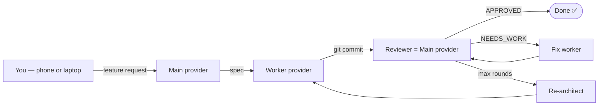

# Concepts

DevLoop is a small bash script with a few load-bearing ideas. Understand
these five and you understand the whole tool.

| Concept | TL;DR |
|---|---|
| [Pipeline](pipeline.md) | architect → worker → reviewer → fix → learn, with state on disk |
| [Providers & Failover](providers.md) | Mix main/worker across Claude, Copilot, OpenCode, Pi — auto-failover on rate limits |
| [Worker Modes](worker-modes.md) | `cli` (local provider CLI) vs `github-agent` (GitHub Issue → Copilot PR) |
| [Permissions](permissions.md) | Smart `PreToolUse` hook: block dangerous, allow safe, escalate the rest |
| [Fix Escalation](fix-escalation.md) | Standard fix → deep fix (history injected) → re-architect |

## The 30-second tour

DevLoop sits between **you** (typing a feature request) and your **AI
provider CLIs** (Claude, Copilot, etc.). Its job is to keep the
design → implement → review → fix loop running without you having to
shepherd it.



State lives in `.devloop/`:

```text
.devloop/
├── specs/<TASK-ID>.md          ← architect output
├── specs/<TASK-ID>.review.md   ← reviewer output
├── sessions/<TASK-ID>/         ← per-phase logs + events
├── events.ndjson               ← project-wide event stream
├── permissions.yaml            ← per-project allow/deny lists
├── permission-queue/           ← pending escalations
└── provider-health.sh          ← failover snapshot
```

The bash engine writes; the TUI reads. There is no daemon, no database —
just files updated atomically and a long-lived provider session.
