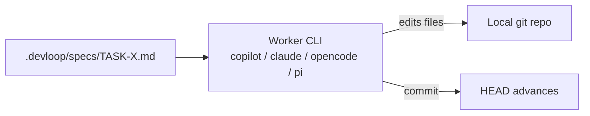

# Worker Modes

The worker phase of the pipeline can run in two modes. The choice is
project-level and lives in `devloop.config.sh`:

```bash
DEVLOOP_WORKER_MODE=cli            # default
DEVLOOP_WORKER_MODE=github-agent   # opt-in
```

## `cli` mode (default)

The worker provider's local CLI is invoked with the spec as input. The
CLI makes the edits and commits directly to the current branch.



Pros:

- Fast — no network handoff, no external coordination.
- Works offline (modulo the provider's own connectivity).
- The same shell session, so env vars, secrets, and `.envrc` Just Work.

Cons:

- The worker has full local file-system access. Use the
  [Smart Permissions](permissions.md) hook to constrain it.
- Long-running fixes occupy your local provider CLI session.

## `github-agent` mode

Instead of running the worker CLI locally, DevLoop:

1. Creates a GitHub Issue with the spec as the body and a
   `DEVLOOP_TASK_ID` label.
2. The [GitHub Copilot coding agent](https://docs.github.com/en/copilot/using-github-copilot/coding-agent)
   picks up the issue and opens a PR with the implementation.
3. DevLoop polls the issue and PR until the PR is ready.
4. The reviewer runs on the PR's diff.


Requirements:

- `gh` CLI installed and authenticated.
- The repo has the **Copilot coding agent** enabled (Settings → Code &
  automation → Copilot agents).
- The repo is hosted on GitHub.

Pros:

- The worker runs in GitHub-managed compute — you can close your laptop.
- Every implementation is a PR — natural fit for code review and CI.
- Multiple tasks can be in flight simultaneously without local resource
  contention.

Cons:

- Slower (minutes, not seconds, for the agent to start).
- Constrained to whatever the Copilot agent can do in its sandbox.
- Costs Copilot agent quota.

## Switching modes

Edit `devloop.config.sh`:

```bash
DEVLOOP_WORKER_MODE=github-agent
```

Then run `devloop doctor` — it will verify `gh` is installed and warn
if the repo doesn't have the agent enabled.

## When to use which

| Situation | Mode |
|---|---|
| Solo dev, fast iteration | `cli` |
| You want every change as a reviewable PR | `github-agent` |
| Working on multiple features in parallel | `github-agent` |
| Off-the-grid / air-gapped | `cli` |
| Strict permission requirements | `cli` with `DEVLOOP_PERMISSION_MODE=strict` |
| Spec is large and your laptop is busy | `github-agent` |

You can switch per-project, but not per-run.
